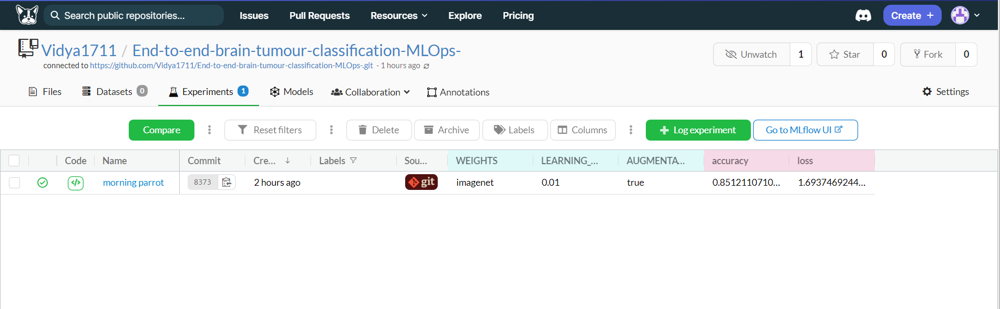
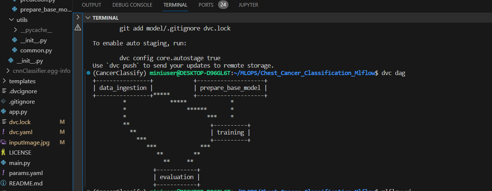
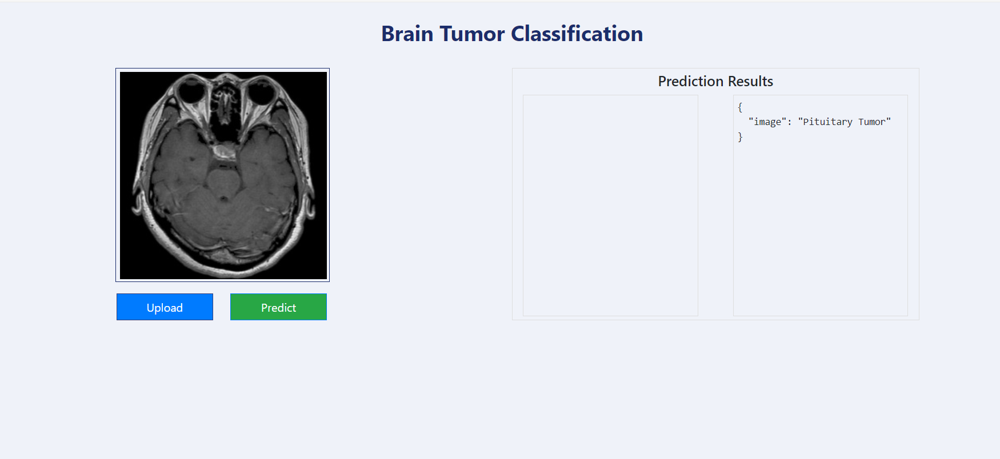

# Brain Tumor Classification Project

## Project Description
This project aims to classify brain tumor images to determine whether a person has a pituitary brain tumor or not. It utilizes Deep Learning techniques, specifically the VGG16 architecture implemented in Keras, to analyze and classify brain images.

## Features
* Utilizes Deep Learning for accurate classification.
* Uses VGG16 architecture pretrained on ImageNet for feature extraction.
* Incorporates Data Version Control (DVC) for managing data and model versioning.
* Integrates with Dagshub for experiment tracking and collaboration.
* Provides a prediction web application for easy inference.

## Usage
1. Clone the repository:

```bash 
git clone <repository_URL>
```
2. Install Dependencies:
```bash 
pip install -r requirements.txt
```
3. Train the Model:

Use DVC to manage data and reproduce the experiments:
```bash 
dvc init
dvc repro
dvc dag
```
4. Track Experiments:

Initiate Dagshub for experiment tracking and collaboration:
```bash 
dagshub init
dagshub run "python main.py"
```
5. Run Prediction Web Application:

Launch the prediction web application using Flask:
```bash
python app.py
```


# Dagshub
## To track using dagshub you need to run this in your environment.

MLFLOW_TRACKING_URI=your dagshub repo url 

MLFLOW_TRACKING_USERNAME= your username 

MLFLOW_TRACKING_PASSWORD= your password 

Run this to export as env variables:
```bash 
export MLFLOW_TRACKING_URI= your dagshub repo url 

export MLFLOW_TRACKING_USERNAME=your username 

export MLFLOW_TRACKING_PASSWORD=your password 
```




# DVC


# Predictions




## License

This project is licensed under the MIT License - see the license [MIT](https://choosealicense.com/licenses/mit/)


